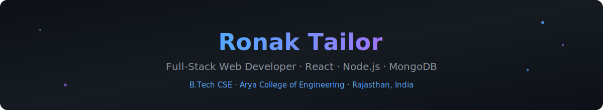

<h1>Hi 👋, I'm Ronak Tailor</h1>

  
  
  

  
  
  
  
  

---

## 📌 About Me

I'm **Ronak Tailor**, a 2nd year B.Tech Computer Science Engineering student at **Arya College of Engineering**, Rajasthan, India. I love solving DSA problems and building real-world projects that combine clean frontend design with solid backend logic.

- 📍 **Location:** Rajasthan, India
- 🎓 **Education:** B.Tech CSE, Arya College of Engineering (2nd Year) · CGPA: 8.5
- 🔭 **Currently learning:** React, Node.js, MongoDB
- 🎯 **Interested in:** Full Stack Development · Software Engineering · AI
- 💼 **Open to work:** ✅ Yes
- ⚡ **Fun fact:** I love solving DSA problems and building real-world projects 🚀

---

## 💻 Tech Stack

**Languages**

**Frontend**

**Backend & Database**

**Tools**

**Cloud**

**AI / ML**

  
  
  
  

---

## 🚀 Featured Projects

<table>
<tr>
<td width="50%">

### 🌐 Portfolio Website
**Tech:** HTML, CSS, JavaScript
My personal portfolio showcasing projects and skills.

</td>
<td width="50%">

### ⛅ Weather App
**Tech:** HTML, CSS, JavaScript, API
Real-time weather info using a public weather API.

</td>
</tr>
<tr>
<td width="50%">

### 💬 Chat Application
**Tech:** MERN Stack
Real-time chat app built with MongoDB, Express, React & Node.

</td>
<td width="50%">

### 🤖 AI Chatbot
**Tech:** React + Gemini API
Conversational chatbot powered by Google's Gemini API.

</td>
</tr>
<tr>
<td width="50%">

### 🛒 E-commerce Website
**Tech:** MERN Stack
Full-stack e-commerce platform with cart & checkout flow.

</td>
<td width="50%">

</td>
</tr>
</table>

---

## 🏆 Coding Profiles

  
  

  
  

---

## 📊 GitHub Analytics

  
  

  

---

## 🐍 Contribution Snake

  

---

## 🏅 GitHub Trophies

  

---

## 📜 Certifications

  
  
  

  
  
  

---

## 💭 Quote

  

---

## 📫 Connect With Me

  
  
  
  

---

<i>⭐ Agar koi project pasand aaye toh star zaroor karna!</i>

